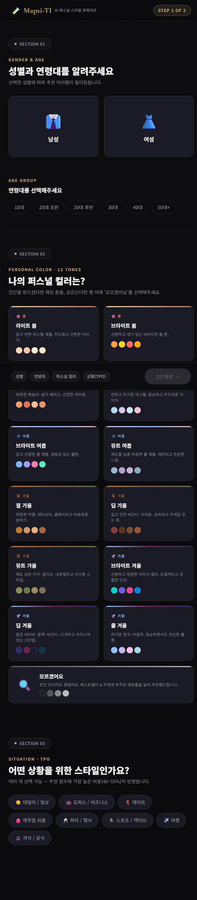
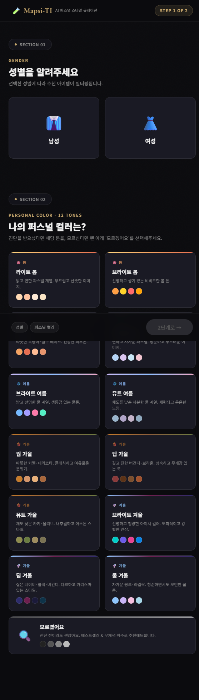

# 개인 프로젝트: DayeKimmy

> 이 디렉토리는 **DayeKimmy** 의 개인 작업 공간입니다.

## 프로젝트 설명

사용자의 성별과 퍼스널 컬러(12톤)와 개인취향을 입력받아 최적화된 스타일 가이드를 제안하는 **AI 퍼스널 스타일 큐레이션 서비스**의 입력 모듈입니다.

## 📺 데모 (Demo: Before & After

사용자 경험(UX) 최적화를 위해 복잡한 입력 단계를 제거하고 핵심 데이터에 집중하도록 개선하였습니다.

| 수정 전 (기존 모델) | 수정 후 (연령/TPO삭제) |
| :---: | :---: |
|  |  |
| 연령대 및 상황(TPO) 등 다단계 입력 | 성별 및 퍼스널 컬러 중심의 간소화된 UI |

> **주요 개선 사항:**
> - **이탈률 방지:** 불필요한 입력 데이터(Age, TPO)를 제거하여 사용자 접근성 향상
> - **시각적 집중도:** 12가지 세부 퍼스널 컬러 톤 선택지에 디자인적 집중도 강화
> - **실시간 피드백:** 선택 상태에 따른 하단 요약 바(Pill) 및 버튼 활성화 로직 최적화

---

## 🛠 기술 스택 (Tech Stack)
이 프로젝트는 데이터의 정확성과 빠른 인터랙션을 위해 다음 기술들을 사용합니다.

- **Language:** HTML5, JavaScript (ES6+)
- **Styling:** CSS3 (Custom Variables, Flexbox, Grid Layout)
- **Design:** Dark Mode Theme, Grain Overlay UI
- **Version Control:** Git, GitHub
- **Environment:** Conda (Python 3.x 기반 환경 구축)

## 디렉토리 구조

```
members/DayeKimmy/
├── .copilot-instructions.md   ← Agent 지시 파일 (수정 가능)
├── DEVLOG.md                  ← 변경사항 기록
├── environment.yml            ← conda 환경 파일
├── requirements.txt           ← pip 패키지 목록
├── README.md                  ← 이 파일
└── src/
    ├── main.py                ← 메인 코드
    ├── mapsi-ti.jsx    ← 스타일 큐레이션 UI/로직 코드
    ├── demo_before.png ← 수정 전 데모 이미지
    └── demo_after.png  ← 수정 후 데모 이미지
```

## 실행 방법

```bash
# 환경 활성화
conda activate DayeKimmy-env

# 실행
python src/main.py
```

## 변경 이력

[DEVLOG.md](DEVLOG.md) 참조
