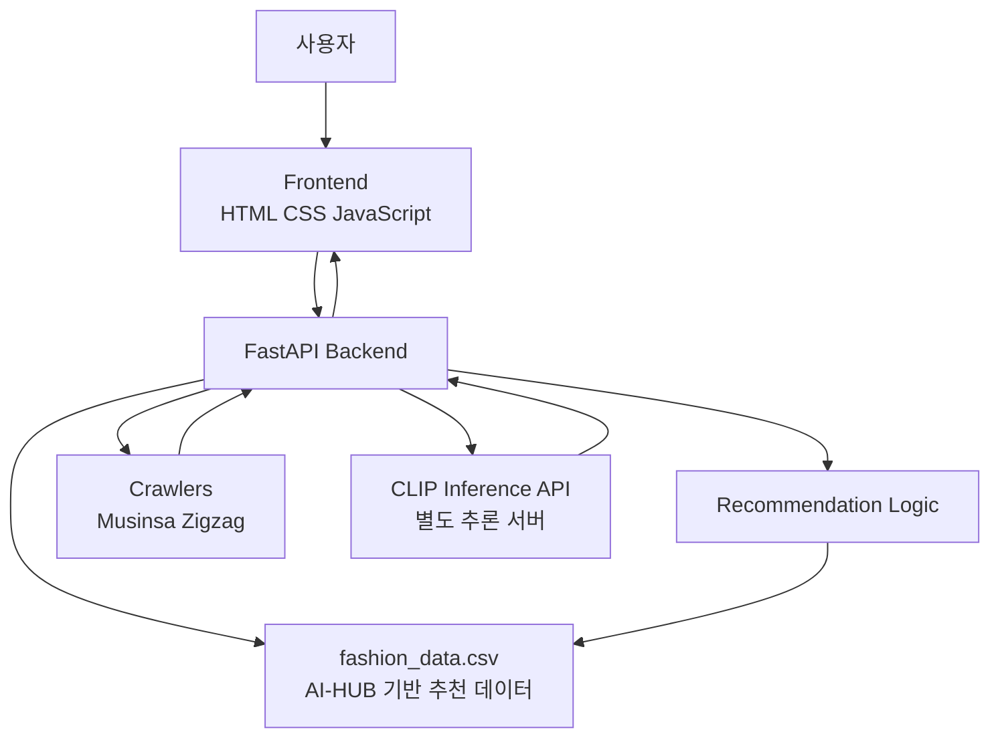
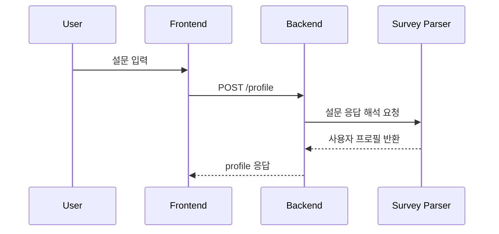
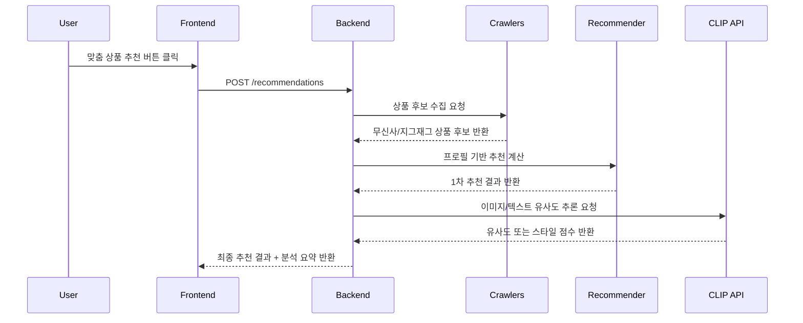

# Architecture

## 1. 프로젝트 개요

이 프로젝트는 **설문 기반 패션 추천 서비스**를 중심으로, 크롤링한 실제 쇼핑몰 상품과 **멀티모달 CLIP 추론**을 결합해 사용자 취향에 맞는 패션 아이템을 추천하는 웹 애플리케이션이다.

사용자는 설문을 통해 자신의 성별, 퍼스널컬러, 선호 핏, 스타일 성향을 입력하고, 시스템은 이를 기반으로 사용자 프로필과 페르소나 텍스트를 생성한다. 이후 무신사·지그재그에서 수집한 상품 후보군과 비교하여 맞춤형 추천 결과를 제공한다.

핵심 설계 방향은 다음 두 가지다.

- **설문 기반 추천의 해석 가능성**: 사용자의 선택이 어떤 분석 결과로 이어졌는지 결과 화면에서 설명 가능해야 한다.
- **멀티모달 추천의 정교함**: 텍스트로 표현된 취향과 실제 상품 이미지의 분위기를 함께 반영해야 한다.

---

## 2. 전체 아키텍처 개요



이 시스템은 크게 다음 5개 계층으로 구성된다.

1. **Frontend Layer**: 설문 입력, 결과 화면, 사용자 상호작용 담당  
2. **API Layer**: 프론트엔드 요청을 받아 추천 로직과 크롤링 기능을 연결  
3. **Recommendation Logic Layer**: 설문 해석, 프로필 생성, 유사도 계산, 추천 결과 생성  
4. **Data Collection Layer**: 무신사·지그재그 상품 수집  
5. **AI Inference Layer**: CLIP 기반 이미지-텍스트 유사도 추론 담당

---

## 3. 디렉터리 관점의 구조

현재 프로젝트는 프론트엔드와 백엔드를 분리한 구조이며, 추천 로직과 데이터 자산이 백엔드 내부에 포함되어 있다.

```text
project/
├─ backend/
│  ├─ app/
│  │  ├─ main.py
│  │  ├─ api/
│  │  │  ├─ router.py
│  │  │  └─ routes/
│  │  │     └─ recommendation.py
│  │  ├─ services/
│  │  │  ├─ recommendation_service.py
│  │  │  └─ ai_similarity_service.py
│  │  ├─ logic/
│  │  │  ├─ survey_parser.py
│  │  │  ├─ fashion_config.py
│  │  │  ├─ item_feature_builder.py
│  │  │  ├─ recommender.py
│  │  │  └─ fashion_data.csv
│  │  ├─ crawlers/
│  │  │  ├─ musinsa_crl.py
│  │  │  └─ zigzag_crl.py
│  │  └─ schemas/
│  ├─ tests/
│  ├─ Dockerfile
│  └─ requirements.txt
├─ frontend/
│  ├─ index.html
│  ├─ survey.html
│  ├─ result.html
│  ├─ css/
│  │  └─ style.css
│  ├─ js/
│  │  ├─ api.js
│  │  ├─ survey.js
│  │  ├─ result.js
│  │  └─ utils.js
│  └─ assets/
├─ docs/
│  └─ screenshots/
└─ README.md
```

실제 구현에서는 `main.py`가 서버 진입점 역할을 수행하며, 일부 기능은 라우터/서비스 레이어로 분리되어 있다. 즉, 현재 구조는 **단일 진입점 중심 설계** 위에 **서비스 분리형 구조로 확장 중인 상태**로 볼 수 있다.

---

## 4. 핵심 컴포넌트 설명

### 4.1 Frontend

프론트엔드는 정적 HTML, CSS, JavaScript로 구성되어 있으며, 사용자 경험 중심의 가벼운 구조를 가진다.

#### 주요 역할
- 설문 입력 UI 제공
- 설문 응답을 API 요청 포맷으로 변환
- 추천 결과 및 분석 요약 카드 렌더링
- 사용자가 버튼을 눌렀을 때만 상품 추천 결과 노출

#### 주요 파일
- `survey.html`: 설문 입력 화면
- `result.html`: 결과 화면
- `js/api.js`: 백엔드 API 호출 담당
- `js/survey.js`: 설문 상태 관리 및 제출
- `js/result.js`: 분석 요약, 추천 결과, 상품 리스트 렌더링
- `css/style.css`: 결과 카드 및 전체 UI 스타일 정의

---

### 4.2 FastAPI Backend

백엔드는 프론트엔드와 추천 로직, 크롤러, 외부 CLIP 추론 서버를 연결하는 **오케스트레이션 계층**이다.

#### 주요 역할
- 프론트엔드 요청 수신
- 설문 데이터를 사용자 프로필로 변환
- 추천용 후보 상품 수집 요청
- 추천 점수 계산 및 결과 반환
- 분석 요약 데이터 생성

#### 대표 엔드포인트
- `POST /profile`  
  설문 응답을 바탕으로 사용자 프로필 생성

- `POST /recommendations`  
  추천 결과와 분석 요약 반환

- `POST /crawl/musinsa`  
  무신사 상품 크롤링 수행

- `POST /crawl/zigzag`  
  지그재그 상품 크롤링 수행

---

### 4.3 Recommendation Logic

추천 로직은 이 프로젝트의 핵심이다. 설문 데이터를 해석하고, 스타일 키워드와 데이터 자산을 결합하여 추천 기준을 만든다.

#### 주요 모듈

**`survey_parser.py`**  
설문 응답을 해석해 사용자 프로필 형태로 정규화한다. 예를 들어 성별, 퍼스널컬러, 핏 선호, 스타일 키워드 등을 내부 로직에서 활용 가능한 구조로 변환한다.

**`fashion_config.py`**  
스타일 라벨, 퍼스널컬러, 핏, 추천용 키워드 매핑과 같은 설정성 정보를 관리한다.

**`item_feature_builder.py`**  
크롤링한 상품 데이터를 추천 계산에 사용할 feature 형태로 가공한다.

**`recommender.py`**  
유사도 기반 추천 계산을 수행한다. 사용자의 프로필과 상품 feature, 그리고 데이터 자산을 기반으로 후보군을 정렬한다.

---

### 4.4 fashion_data.csv의 역할

`fashion_data.csv`는 단순 샘플 데이터가 아니라, **추천 로직의 근거가 되는 핵심 자산**이다.

이 파일은 **AI-HUB에서 제공하는 연도별 패션 선호도 파악 및 추천 데이터**를 기반으로 정리된 데이터이며, 프로젝트에서는 이를 바탕으로 다음과 같은 역할을 수행한다.

- 연도별 패션 취향 특성 반영
- K-Means 기반 스타일 군집화에 활용
- 코사인 유사도 계산을 위한 기준 데이터로 활용
- 기존의 `kmeans_model.pkl` 대신, 추천 기준을 보다 투명하게 관리하는 데이터 자산 역할 수행

즉, 이전처럼 별도 피클 모델 파일을 두는 대신, 추천의 근거가 되는 데이터를 CSV 자산으로 관리하면서 **재현 가능성과 가시성**을 높인 구조라고 볼 수 있다.

---

### 4.5 Crawlers

크롤러 계층은 외부 쇼핑몰에서 실제 상품 후보군을 수집하는 역할을 한다.

#### 수집 대상
- 무신사
- 지그재그

#### 주요 역할
- 카테고리/조건 기반 상품 목록 수집
- 상품명, 이미지, 가격, 링크 등 추천에 필요한 메타데이터 확보
- 추천 요청 시점에 동적으로 후보군 구성

이 구조 덕분에 정적인 더미 상품이 아니라, 실제 쇼핑몰의 최신 상품을 대상으로 추천을 수행할 수 있다.

---

### 4.6 CLIP Inference API

이 프로젝트의 고도화 포인트는 **별도 CLIP 추론 서버**를 활용한 멀티모달 추천이다.

#### 도입 배경
설문 기반 추천만으로는 사용자가 원하는 분위기, 무드, 스타일 감성을 이미지 수준에서 정교하게 반영하기 어렵다. 이를 해결하기 위해 이미지와 텍스트를 같은 임베딩 공간에서 비교할 수 있는 CLIP 구조를 활용했다.

#### 역할
- 상품 이미지 벡터화
- 사용자 페르소나 텍스트와의 유사도 비교
- 스타일 후보 라벨에 대한 confidence 계산
- 추천 결과 재정렬 또는 보정

#### 특징
- Hugging Face의 CLIP 모델 활용
- AI-HUB 패션 이미지/스타일 데이터 기반 파인 튜닝
- 별도 추론 서버 형태로 분리 운영
- 추천 백엔드와 HTTP API로 연동

이 구조는 추천 서버와 추론 서버의 책임을 분리해, 무거운 모델 추론을 독립적으로 운영할 수 있도록 한다.

---

## 5. 요청 처리 흐름

### 5.1 설문 제출부터 프로필 생성까지



이 단계에서는 사용자의 설문 응답을 내부 추천 로직이 다룰 수 있는 정규화된 프로필로 변환한다.

---

### 5.2 맞춤 상품 추천 요청 흐름



현재 프론트엔드는 사용자가 결과 화면에 진입했다고 바로 상품을 보여주지 않고, **버튼 클릭 시점에만 추천 결과를 요청**하도록 설계되어 있다. 이로 인해 초기 렌더링이 단순해지고, 더미 데이터 노출 문제도 방지할 수 있다.

---

## 6. 분석 요약 카드 구조

결과 화면에는 추천 결과와 함께 **분석 요약 카드**가 표시된다. 이 UI는 설문 기반 추천 결과를 사용자가 이해하기 쉽도록 시각화하기 위해 도입되었다.

### 포함 정보
- 시대감성 또는 분석된 연도 라벨
- 대표 스타일 라벨
- 유사도 퍼센트
- 성별
- 퍼스널컬러
- 핏 정보

### 목적
- 추천 결과에 대한 설명 가능성 확보
- 사용자가 “왜 이런 결과가 나왔는지” 직관적으로 이해하도록 지원
- 포트폴리오 관점에서 추천 시스템의 해석 가능성을 강조

---

## 7. 데이터 흐름 관점 정리

이 시스템의 데이터 흐름은 크게 세 단계로 나눌 수 있다.

### 7.1 입력 단계
- 사용자의 설문 응답 수집
- 성별, 퍼스널컬러, 핏, 스타일 키워드 입력

### 7.2 처리 단계
- 설문 응답을 프로필로 정규화
- `fashion_data.csv`를 기반으로 취향 분석
- 쇼핑몰 상품 크롤링
- 상품 이미지 및 텍스트 기반 유사도 계산

### 7.3 출력 단계
- 추천 상품 리스트 반환
- 분석 요약 카드 반환
- 스타일 팁 및 포인트 컬러 정보 렌더링

---

## 8. 멀티모달 추천 설계 원칙

이 프로젝트에서 중요한 설계 원칙은 **텍스트와 이미지가 같은 특징 공간에서 비교되어야 한다**는 점이다.

CLIP 모델을 AI-HUB 패션 데이터로 파인 튜닝하면, 모델은 일반적 시각-언어 이해가 아니라 **패션 도메인 특화 기준**으로 텍스트와 이미지를 해석하게 된다. 따라서 추천 시스템에서 다음 두 가지는 반드시 동일한 파인 튜닝 모델을 거쳐야 한다.

- 사용자 페르소나 텍스트 벡터화
- 크롤링한 상품 이미지 벡터화

이 구조를 적용하면 사용자의 문장형 취향 표현과 실제 상품 이미지의 분위기를 더 일관된 기준으로 비교할 수 있다.

---

## 9. 배포 및 실행 구조

현재 프로젝트는 로컬 개발과 단일 서버 실행에 적합한 구조를 우선으로 한다.

### 기본 실행 방식
- FastAPI 서버 실행
- 프론트엔드는 정적 파일로 제공하거나 별도 정적 호스팅 가능
- CLIP 추론 서버는 별도 프로세스 혹은 별도 컨테이너로 운영

### 논리적 배포 단위
1. **Web App Server**  
   FastAPI + 정적 프론트 제공

2. **Crawler Execution Layer**  
   쇼핑몰 크롤링 작업 수행

3. **CLIP Inference Server**  
   GPU 기반 추론 담당

향후 운영 환경에서는 FastAPI 서버와 CLIP 서버를 분리 배포하는 것이 안정적이다. 추천 요청은 빈도가 높을 수 있지만, CLIP 추론은 상대적으로 리소스 사용량이 크기 때문이다.

---

## 10. 현재 구조의 장점

### 10.1 설명 가능한 추천
설문 기반 분석과 분석 요약 UI 덕분에 사용자는 추천 결과를 납득하기 쉽다.

### 10.2 구조적 확장 가능성
현재는 `main.py` 중심 구조가 남아 있지만, 이미 `api`, `services`, `logic` 계층이 분리되어 있어 점진적 리팩토링이 가능하다.

### 10.3 추천 품질 고도화 가능성
CLIP 멀티모달 구조를 통해 단순 속성 추천에서 이미지 분위기 기반 추천까지 확장할 수 있다.

### 10.4 데이터 자산의 투명성
`fashion_data.csv`를 중심으로 추천 근거를 관리함으로써, 피클 파일보다 데이터 흐름을 더 명확히 보여줄 수 있다.

---

## 11. 개선 포인트

### 11.1 라우터와 메인 진입점 정리
일부 엔드포인트가 `main.py`에 직접 구현되어 있다면, 향후 `api/routes`와 `services` 중심 구조로 완전히 정리하는 것이 유지보수에 유리하다.

### 11.2 크롤링 안정성 강화
외부 쇼핑몰 구조 변경에 따라 크롤러가 깨질 수 있으므로, 예외 처리와 재시도 로직, 셀렉터 관리 전략이 필요하다.

### 11.3 추천 결과 캐싱
동일 조건에 대한 반복 요청이 많다면, 크롤링 결과와 유사도 계산 결과를 캐싱해 응답 속도를 개선할 수 있다.

### 11.4 벡터 DB 연계
향후에는 상품 이미지 벡터를 사전 계산해 벡터 DB에 저장하고, 실시간 추론 비용을 줄이는 구조로 발전시킬 수 있다.

### 11.5 관측성 확보
추천 요청 수, CLIP 추론 시간, 크롤링 실패율 등을 로깅/모니터링하면 운영 안정성이 올라간다.

---

## 12. 결론

이 프로젝트의 아키텍처는 단순한 웹 추천 서비스가 아니라,

- **설문 기반 사용자 분석**
- **AI-HUB 기반 데이터 자산 활용**
- **쇼핑몰 상품 크롤링**
- **CLIP 기반 멀티모달 유사도 추천**

을 결합한 **하이브리드 패션 추천 시스템**으로 정리할 수 있다.

즉, 해석 가능한 규칙 기반 추천의 장점과, 멀티모달 딥러닝 기반 추천의 정교함을 하나의 서비스 흐름 안에 통합한 구조이며, 포트폴리오 관점에서도 시스템 설계 의도와 기술적 확장성을 함께 보여줄 수 있는 아키텍처다.

